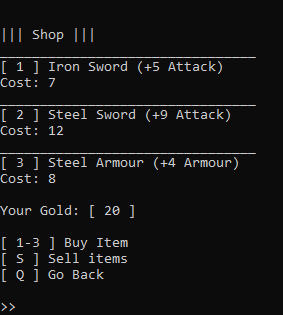

# Sacred River 2
A simple terminal text-based RPG game made in Python 3.6

Still not in very usable state.

***

# Preview

***

# To do:

### Bugs:

- Can only equip an item if you have more than one item in it

- Can only sell items if you have more than one item in it

### Features:

- In-game Library with books and stuff

- Add Health potion to shop
    - Make it drinkable from inventory and when in combat
    
- Add more combat functions
    - Run
    - Drink HP potions
    - Equip/Unequip items (possibly unnecessary)
    - Different combat stances?
        - Defensive/Aggressive/Accurate

- Add a way for user to reset save state inside the game
    - Can currently be done manually by deleting "inventory.ini" and "user_stats.ini"