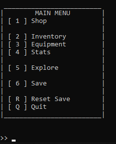

# Sacred River 2
A simple terminal text-based RPG game made in Python 3.6

***

# Preview

***

# Requirements

- None besides Python 3.6+, 100% Pure Python

***

# Running

- Open sacred-river folder on a terminal and do `python sacredriver.py` (`python3 sacredriver.py` on Linux) nothing special to it

***

# To do:

https://github.com/johnvictorfs/sacred-river-2/issues
